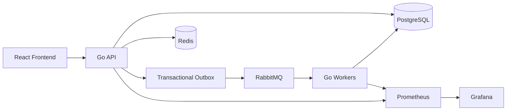
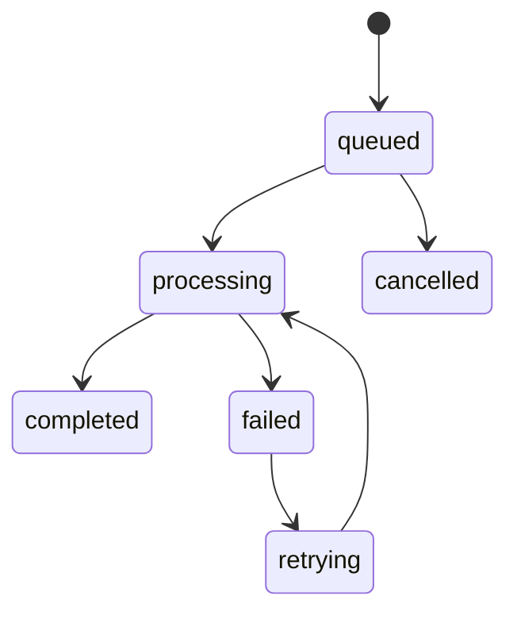

# TaskFlow — Distributed Job Processing Platform

A distributed job processing platform built with Go, React, PostgreSQL, RabbitMQ, Redis, and Kubernetes. It provides a REST API for submitting jobs, asynchronous processing through workers, retry and reliability mechanisms, and a dashboard for monitoring job execution.


## Contents

- [Overview](#overview)
- [Key Features](#key-features)
- [Architecture](#architecture)
- [Job Lifecycle](#job-lifecycle)
- [Transactional Outbox](#transactional-outbox)
- [Technology Stack](#technology-stack)
- [Project Structure](#project-structure)
- [Prerequisites](#prerequisites)
- [Quick Start](#quick-start)
- [API](#api)
- [Configuration](#configuration)
- [Reliability](#reliability)
- [Kubernetes](#kubernetes)
- [Observability](#observability)
- [Testing](#testing)
- [Engineering Decisions](#engineering-decisions)
- [Future Improvements](#future-improvements)
- [License](#license)

## Overview

TaskFlow is an asynchronous job processing system designed to move slow, resource-intensive work out of the main HTTP request cycle. When a client submits a heavy task (like generating a large report or processing batch data), the API immediately acknowledges the request and safely queues it for background execution.

The API and worker tiers can be scaled independently. Job status and execution logs are persisted in PostgreSQL and surfaced through the React dashboard.

## Key Features

| Area | Features |
|---|---|
| **API** | REST API built with Go and Chi |
| **Authentication** | JWT authentication and request authorization |
| **Jobs** | Job creation, listing, cancellation, and status tracking |
| **Reliability** | Transactional outbox, idempotency, retries with exponential backoff |
| **Workers** | Concurrent RabbitMQ consumers with graceful shutdown and panic recovery |
| **Rate Limiting** | Redis-backed sliding window per user |
| **Frontend** | React + TypeScript dashboard with live polling and progress tracking |
| **Observability** | Prometheus metrics and Grafana dashboards |
| **Infrastructure** | Docker Compose, Kubernetes manifests, Terraform |

## Architecture



### Components

- **React frontend** — The user interface for submitting jobs and tracking their real-time progress.
- **Go API** — The HTTP server handling authentication, validation, and job persistence.
- **PostgreSQL** — The primary data store for users, job metadata, execution logs, and outbox events.
- **Redis** — High-performance cache utilized for distributed rate limiting.
- **RabbitMQ** — The message broker that holds queued jobs and distributes them to available workers.
- **Go Workers** — Background services that consume from RabbitMQ, execute the actual work, and report status back to PostgreSQL.
- **Prometheus/Grafana** — Metric collection and visualization for system observability.

## Job Lifecycle



Once a job is submitted, it enters the `queued` state. A worker picks it up and transitions it to `processing`. If the execution finishes successfully, the job is marked `completed`. If an error occurs, it is marked `failed` and will transition to `retrying` based on an exponential backoff schedule, until maximum retries are exhausted. Jobs can also be `cancelled` while waiting in the queue.

## Transactional Outbox

TaskFlow uses the Transactional Outbox pattern to keep job persistence and message publication reliable.

```text
API Request
    |
    v
PostgreSQL Transaction
    |------------------|
    |                  |
 Create Job      Create Outbox Event
    |                  |
    |------------------|
             |
           Commit
             |
             v
      Outbox Publisher
             |
             v
         RabbitMQ
             |
             v
          Worker
```

The job record and outbox event are persisted together in a single database transaction. This ensures that job creation does not depend on RabbitMQ being immediately available. A background publisher routine reliably reads from the outbox table and forwards the events to RabbitMQ.

## Technology Stack

### Backend

| Technology | Purpose |
|---|---|
| Go 1.26 | API and worker services |
| Chi | HTTP routing |
| PostgreSQL 17 | Persistent data storage |
| pgx | PostgreSQL driver |
| RabbitMQ 4 | Asynchronous job delivery |
| Redis 7 | Rate limiting |
| JWT | Authentication |
| slog | Structured logging |

### Frontend

| Technology | Purpose |
|---|---|
| React 18 | UI |
| TypeScript | Type safety |
| Vite | Frontend build tooling |
| TanStack Query | Server-state management |

### Platform & Observability

| Technology | Purpose |
|---|---|
| Docker | Containerization |
| Kubernetes | Container orchestration |
| Terraform | Infrastructure definitions |
| Prometheus | Metrics |
| Grafana | Dashboards |

## Project Structure

```text
.
├── backend/
│   ├── cmd/
│   │   ├── api/
│   │   └── worker/
│   ├── internal/
│   │   ├── config/
│   │   ├── database/
│   │   ├── handler/
│   │   ├── metrics/
│   │   ├── middleware/
│   │   ├── models/
│   │   ├── queue/
│   │   ├── redis/
│   │   ├── repository/
│   │   ├── router/
│   │   ├── service/
│   │   ├── validator/
│   │   └── worker/
│   ├── migrations/
│   └── pkg/
├── frontend/
│   └── src/
├── deploy/
│   └── kubernetes/
├── terraform/
├── docker-compose.yml
├── Makefile
└── README.md
```

## Prerequisites

- Go 1.26+
- Node.js 22+
- Docker
- Docker Compose
- kubectl (optional, for cluster deployment)
- Terraform (optional, for AWS deployment)

## Quick Start

### Docker Compose

The easiest way to run the entire stack locally is using Docker Compose.

```bash
git clone https://github.com/vishal-cody/TaskFlow.git
cd TaskFlow
docker compose up --build -d
```

- The React frontend will be available at `http://localhost:3000`.
- The API will be available at `http://localhost:8080`.

### Local Development

For active development, run the services directly on your host machine.

```bash
# Start infrastructure (Postgres, RabbitMQ, Redis)
docker compose up -d postgres rabbitmq redis

# Run database migrations
make migrate-up
```

Start the API:

```bash
cd backend
cp .env.example .env
go run ./cmd/api
```

Start the Worker:

```bash
cd backend
go run ./cmd/worker
```

Start the Frontend:

```bash
cd frontend
npm install
npm run dev
```

## API

### Authentication

| Method | Endpoint | Description |
|---|---|---|
| POST | `/api/v1/auth/register` | Register a new user |
| POST | `/api/v1/auth/login` | Login and receive JWT |

### Jobs

| Method | Endpoint | Description |
|---|---|---|
| POST | `/api/v1/jobs` | Create a job |
| GET | `/api/v1/jobs` | List your jobs |
| GET | `/api/v1/jobs/{id}` | Get job details |
| POST | `/api/v1/jobs/{id}/cancel` | Cancel a queued job |
| GET | `/api/v1/jobs/{id}/logs` | Get execution logs |
| GET | `/api/v1/jobs/stats` | Get job statistics |

### Health

| Method | Endpoint | Description |
|---|---|---|
| GET | `/health/live` | Liveness check |
| GET | `/health/ready` | Readiness check |
| GET | `/metrics` | Prometheus metrics |

## API Request Examples

Create a new job using an idempotency key to prevent duplicate submissions:

```bash
curl -X POST http://localhost:8080/api/v1/jobs \
  -H "Authorization: Bearer $TOKEN" \
  -H "Content-Type: application/json" \
  -H "Idempotency-Key: job-req-12345" \
  -d '{
    "type": "report_generation",
    "priority": 1,
    "payload": {
      "format": "csv"
    }
  }'
```

## Configuration

The backend is configured via environment variables.

| Variable | Description | Required |
|---|---|---|
| `SERVER_PORT` | API port | No (default: 8080) |
| `DATABASE_URL` | PostgreSQL connection string | Yes |
| `JWT_SECRET` | JWT signing secret | Yes |
| `RABBITMQ_URL` | RabbitMQ connection string | Yes |
| `REDIS_URL` | Redis connection string | Yes |
| `LOG_LEVEL` | Application log level (debug, info) | No |

## Reliability

- **Idempotency**: The API requires an `Idempotency-Key` header for job creation. This prevents accidental duplicate jobs if a client retries a failed HTTP request.
- **Transactional Outbox**: Guarantees at-least-once message delivery by committing the job state and queue event in a single PostgreSQL transaction.
- **Retries & Backoff**: Failed jobs are requeued and retried with an exponential backoff schedule to prevent overwhelming downstream services.
- **State Machine Enforcement**: State transitions utilize optimistic concurrency control (`WHERE status = $expected`) to prevent race conditions across distributed workers.

## Kubernetes

The project includes full manifests for deployment to a Kubernetes cluster.

Included resources:
- API and Worker Deployments
- StatefulSets for PostgreSQL and RabbitMQ
- Deployment for Redis
- Frontend Deployment
- ConfigMaps and Secrets
- Nginx Ingress
- Horizontal Pod Autoscalers (HPA)

To deploy the stack:

```bash
kubectl apply -k deploy/kubernetes/
```

Verification commands:

```bash
kubectl get pods -n jobplatform
kubectl get services -n jobplatform
kubectl get deployments -n jobplatform
```

## Observability

The application exports Prometheus metrics and utilizes Grafana for visualization.

- **Prometheus** scrapes `/metrics` to track HTTP latency, request throughput, job queue depth, and worker efficiency.
- **Grafana** is pre-configured with dashboards running at `http://localhost:3000` inside the K8s cluster.
- **Structured Logs** are emitted using Go's `slog` package for easy ingestion by log aggregators.

## Testing

### Go

```bash
# Run unit tests
cd backend
go test ./...

# Run tests with race condition detector
go test -race ./...
```

### Frontend

```bash
# Verify frontend compilation
cd frontend
npm run build
```

### Load Testing

```bash
# Simulate traffic against the API
k6 run backend/loadtest.js
```

## Engineering Decisions

### Why Go?
Go was chosen for the backend due to its excellent performance, low memory footprint, and native concurrency primitives (goroutines). This makes it highly efficient for both handling thousands of HTTP requests and concurrently executing long-running background tasks.

### Why PostgreSQL?
PostgreSQL provides robust ACID compliance, reliable transactions, and advanced features like `FOR UPDATE SKIP LOCKED`. This ensures data consistency across the job state machine and safely implements the transactional outbox pattern.

### Why RabbitMQ?
RabbitMQ provides durable, asynchronous job delivery and worker decoupling. It supports advanced routing, dead-letter exchanges, and prefetch limits, which allows workers to pull jobs at a sustainable pace without being overwhelmed.

### Why Transactional Outbox?
Writing directly to a message queue from an HTTP handler is risky—if the queue is briefly unavailable, the job is lost. By writing the job and an outbox event to PostgreSQL in the same transaction, we guarantee reliable publication to RabbitMQ once the database commit succeeds.

### Why Redis?
Redis is used as an ultra-fast in-memory data store for distributed rate limiting. It implements a sliding window algorithm to protect the API from excessive traffic. The implementation is designed to "fail open," meaning if Redis goes down, the API continues serving traffic rather than suffering a hard outage.

### Why Kubernetes?
Kubernetes provides container orchestration, service discovery, health check probes, and automated scaling. The Horizontal Pod Autoscaler allows the worker tier to automatically scale out based on queue depth and CPU utilization.

## Future Improvements

- Implementation of WebSocket or Server-Sent Events (SSE) for real-time UI updates without polling.
- Transitioning to managed cloud database and broker services (e.g., AWS RDS, Amazon MQ) in production.
- Distributed tracing (OpenTelemetry) across the API and workers.
- More granular RBAC authorization roles for job management.

## License

MIT
